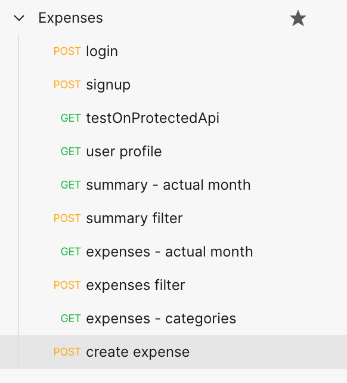
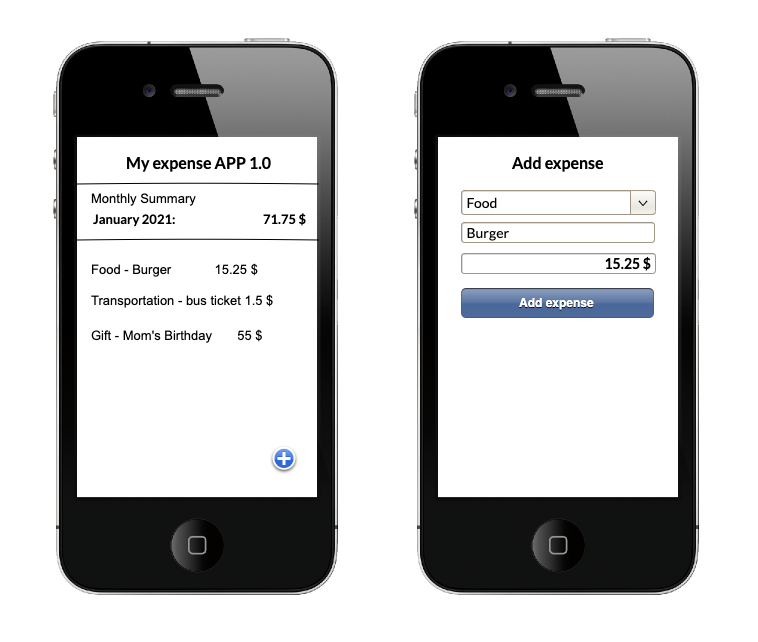

# Expenses - Simple back end App prototype to manage your expenses

### Overview
>Goal of this project is to offer a service layer to save and view your incomes and expenses.

In the every day life we need to handle several costs and collect some incomes. Make sense to have a smart tool to save
and keep under controls our expenses.

As a coding demo, idea of this project is to offer some basic services in order to be used from a mobile App application.

The back end solution is composed of two different architectural components:
* this Spring Boot REST Apis project
* one MySql database

In order to run the software is necessary to create the database instance "expenses".

### Security using JWT: JSON Web Token
This project is using JWT to secure the REST apis.

>JWT stands for JSON Web Token. It's an open industry standard for representing claims securely between two parties.

This project works allowed to login or signup and only after access to the protected resources.

After the login, the user of the app will communicate with the services using a specific json web token.
This token will contain, in this case, the username in order to recover the user information later on.

For more information about JWT refer to the official [JWT web site](https://jwt.io/) .

### Manual test
>Thanks to Postman will be possible to test manually the services.

Create the MySql database schema if not exists and run the web application.

Because the database is empty at the start, using Postman project, create a new user calling the "signup" endpoint.
After that we can login with the new user calling "login" endpoint.

At the login phase the AuthenticationFilter will be called. Here for test purposes and comfort the token will be printed in the server console.
Copying this token to the clipboard and set it on the "testOnProtectedApi" Authorization header.
This will enable the call correctly to the test endpoint. The test response displaied is infact the username of the Principal.

#### UX/UI sketch
To keep it simple this demo, a sketch of the app that solve the problem is as below:

The screens are:
* "Main window": set based on the current year and month, it will display the saved expenses's list. The main window display also the total balance of the current month.
* "Add expense/income window": allow the user to create and store a new expense specifying the amount, category and a text note.

#### Typical solved Use cases
The features offered from the back end services are:
* display the expenses list for the current month
* retrieve the expenses list for a specific year and month 
* create a new expense by pre-defined category
* delete a given expense
* retrieve the expenses's categories (used during the expense creation for the drop down control).

The project contains the necessary setup to navigate the REST APIs using Swagger.

#### Author
This project has been created in February 2021 by Andrea Giassi.

Andrea he's an italian Agile professional and Software Engineer actives in web systems and services.
Since 2002, Andrea is working in the IT market for several different companies and start ups and it has contributed
to the success of several solutions and products.

About me:
https://www.linkedin.com/in/andreagiassi/

Please support this open source with a small donation here:

